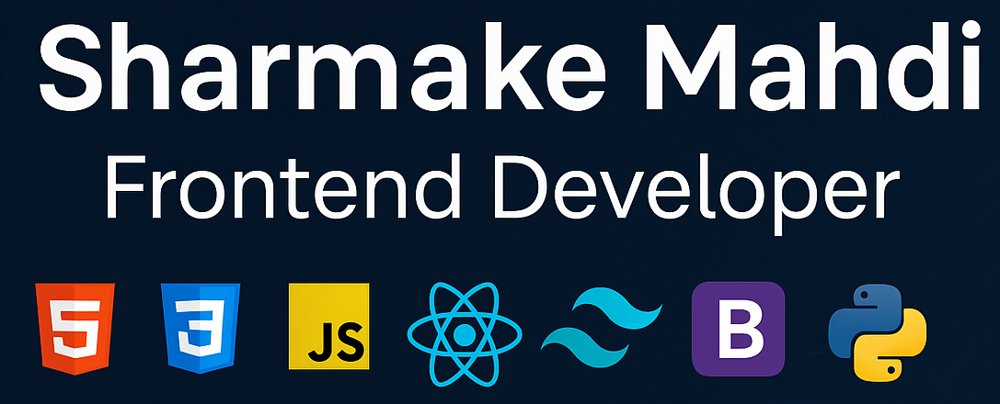

# Hi there 👋, I'm Sharmake Mahdi  
🚀 **Frontend Developer** | HTML • CSS • JavaScript • React.js • Tailwind • Bootstrap • Python  

## 🌟 About Me  
- 🎓 Undergraduate in **Computer Information Systems**  
- 🌱 Currently learning **React.js & Typescript**  
- 💡 Exploring Modern web technologies and networking with developer's communities 
- 🎯 Goal: Build **responsive, modern web apps** and grow as a full-stack developer 

## 💻 Tech Stack
       

## 📌 Featured Projects  
🔹 [Portfolio Website](https://smentor.me/) – My personal portfolio built with **HTML,CSS and JS**  
🔹 [To-Do App](#) – Task manager app with **JavaScript**  
🔹 [Landing Page](https://github.com/SharmanMahdi/Tailwindcss) – Responsive landing page using **Tailwind**  
🔹 [Python Mini Projects](#) – Automation with Python  

---

## 📊 GitHub Stats
  

  

---

## 🌐 Connect with Me
  
  

----

 
----
✨ *"Building frontend experiences that are simple, fast, and user-friendly."*

✨ *Thanks for visiting my profile! Feel free to check out my repositories and connect.*  

